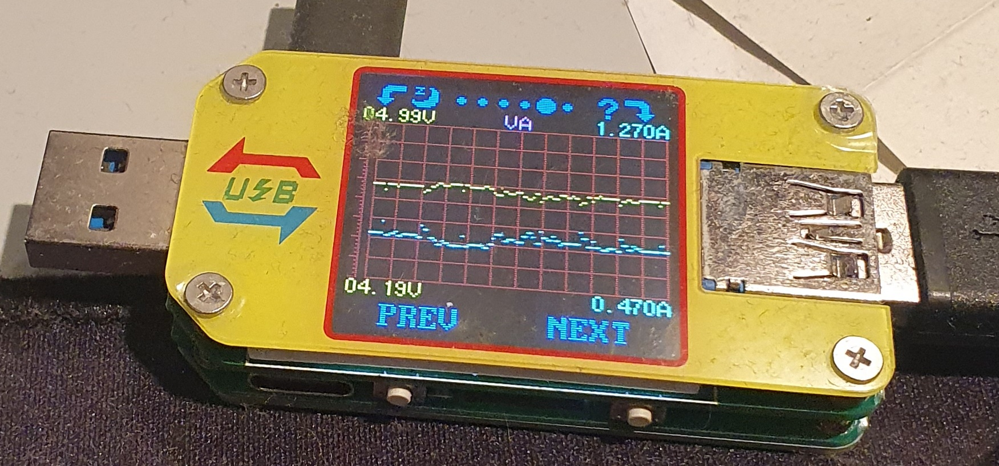

# hdd2leds
HDD activity with LED stripes

# Prequirements

Raspberry Pi settings and wires:
- https://tutorials-raspberrypi.de/raspberry-pi-ws2812-ws2811b-rgb-led-streifen-steuern/

Python-Bindings for WS281x LED stripes:
- https://github.com/rpi-ws281x/rpi-ws281x-python

# Installation

1. place `hdd2tcp.py` on your server you want to monitor
2. place `tcp2leds.py` on your Raspberry Pi connected to the LED stripe

# Run

1. run `tcp2leds.py` on your Raspberry Pi with sudo (sudo is required for GPIO)

   `sudo python3 tcp2leds.py`

2. run `hdd2tcp.py` on your linux system with sudo (sudo is required for reading inside `/sys/block/`)

   `sudo python3 hdd2tcp.py 192.168.178.100`

where `192.168.178.100` is the IP of your Raspberry

# LED Colors

- yellow = reading only
- red = writing only
- blue = writing + reading

# History

## V1 26.01.2022

https://twitter.com/ckarrie/status/1486347204881268738

